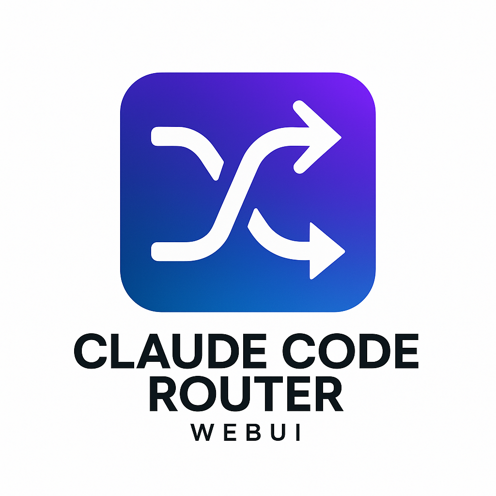
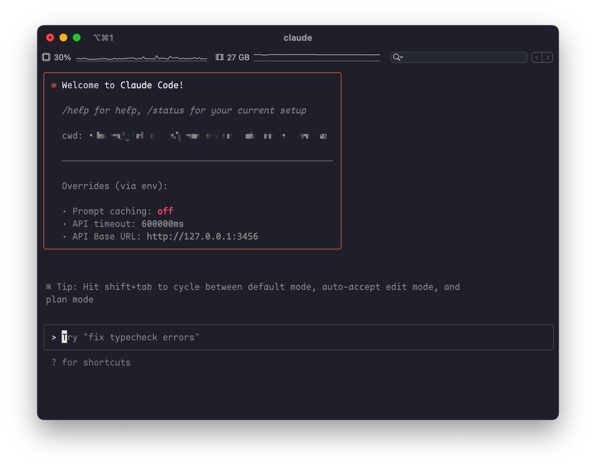
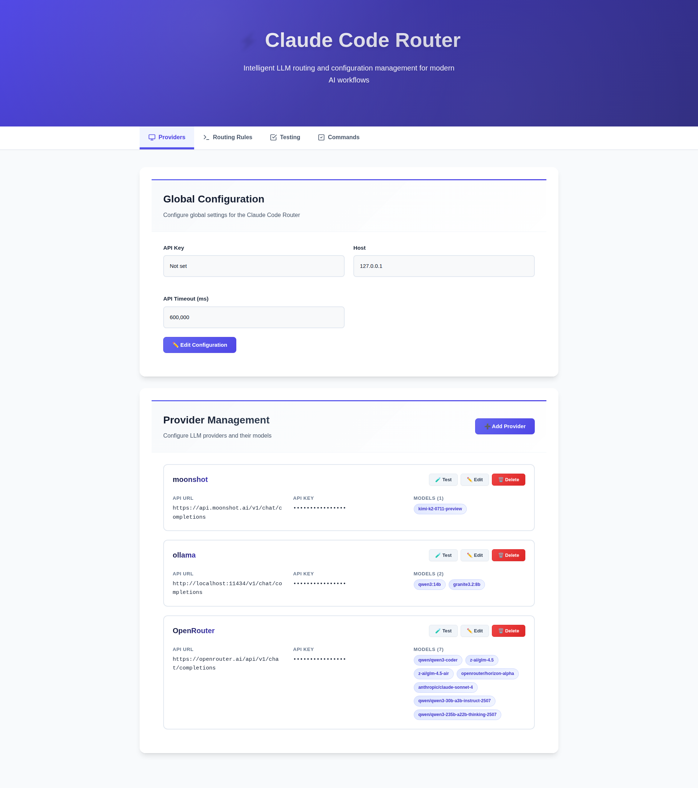
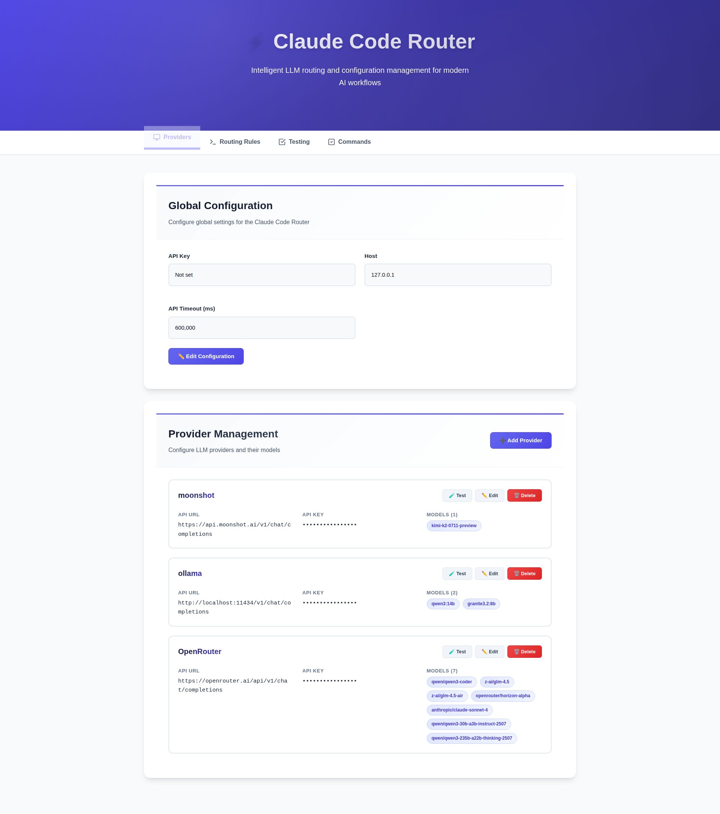
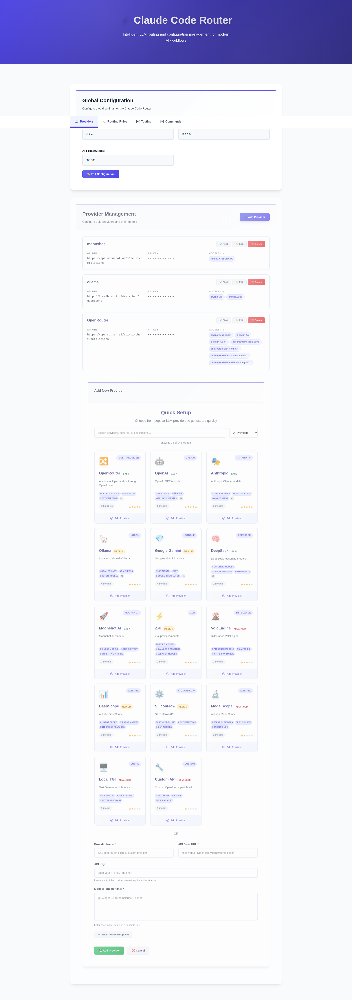

# Claude Code Router

<div align="center">
  
</div>

> A powerful tool to route Claude Code requests to different models and customize any request.



## ✨ Features

- **Model Routing**: Route requests to different models based on your needs (e.g., background tasks, thinking, long context).
- **Multi-Provider Support**: Supports various model providers like OpenRouter, DeepSeek, Ollama, Gemini, Volcengine, SiliconFlow, and Z.ai.
- **Request/Response Transformation**: Customize requests and responses for different providers using transformers.
- **Dynamic Model Switching**: Switch models on-the-fly within Claude Code using the `/model` command.
- **GitHub Actions Integration**: Trigger Claude Code tasks in your GitHub workflows.
- **Plugin System**: Extend functionality with custom transformers.

## 🚀 Getting Started

### 🐳 Quick Start with Docker (Recommended)

For the easiest setup, use our automated Docker installation:

```bash
# Clone the repository
git clone https://github.com/crogers2287/claude-code-router.git
cd claude-code-router

# Run the automated installer
chmod +x install.sh
./install.sh
```

The installer will:
- ✅ Check prerequisites (Docker, Docker Compose)
- ✅ Build the Docker image with Claude Code pre-installed
- ✅ Create the `ccr` command on your system
- ✅ Start both the router service (port 3456) and WebUI (port 3457)
- ✅ Handle partial installations and conflicts automatically

**Available Commands:**
```bash
ccr start      # Start the router service
ccr stop       # Stop the router service
ccr config     # Open WebUI configuration (http://localhost:3457/ui)
ccr login      # Login to Claude Code (authentication persists)
ccr code       # Run Claude Code through the router
ccr logs       # View service logs
ccr status     # Check service status
```

**First-time Setup:**
Before using `ccr code`, you need to authenticate with Claude:
```bash
ccr login   # Login to Claude Code (required first step)
ccr code    # Run Claude Code through the router
```

Your authentication will be saved in `~/.claude` and persist across container restarts. You only need to login once.

**Uninstall:**
```bash
./uninstall.sh  # Removes everything (with option to keep config)
```

**Persistent Storage:**
The Docker setup automatically maps the following directories for data persistence:
- `~/.claude-code-router` → Router configuration
- `~/.claude` → Claude Code authentication data
- `~/.claude.json` → Claude Code settings

This ensures your login and configuration persist across container restarts and updates.

### 📦 Manual Installation

First, ensure you have [Claude Code](https://docs.anthropic.com/en/docs/claude-code/quickstart) installed:

```shell
npm install -g @anthropic-ai/claude-code
```

Then, install Claude Code Router:

```shell
npm install -g @musistudio/claude-code-router
```

### 2. Configuration

Create and configure your `~/.claude-code-router/config.json` file. For more details, you can refer to `config.example.json`.

The `config.json` file has several key sections:

- **`PROXY_URL`** (optional): You can set a proxy for API requests, for example: `"PROXY_URL": "http://127.0.0.1:7890"`.
- **`LOG`** (optional): You can enable logging by setting it to `true`. The log file will be located at `$HOME/.claude-code-router.log`.
- **`APIKEY`** (optional): You can set a secret key to authenticate requests. When set, clients must provide this key in the `Authorization` header (e.g., `Bearer your-secret-key`) or the `x-api-key` header. Example: `"APIKEY": "your-secret-key"`.
- **`HOST`** (optional): You can set the host address for the server. If `APIKEY` is not set, the host will be forced to `127.0.0.1` for security reasons to prevent unauthorized access. Example: `"HOST": "0.0.0.0"`.

- **`Providers`**: Used to configure different model providers.
- **`Router`**: Used to set up routing rules. `default` specifies the default model, which will be used for all requests if no other route is configured.
- **`API_TIMEOUT_MS`**: Specifies the timeout for API calls in milliseconds.

Here is a comprehensive example:

```json
{
  "APIKEY": "your-secret-key",
  "PROXY_URL": "http://127.0.0.1:7890",
  "LOG": true,
  "API_TIMEOUT_MS": 600000,
  "Providers": [
    {
      "name": "openrouter",
      "api_base_url": "https://openrouter.ai/api/v1/chat/completions",
      "api_key": "sk-xxx",
      "models": [
        "google/gemini-2.5-pro-preview",
        "anthropic/claude-sonnet-4",
        "anthropic/claude-3.5-sonnet",
        "anthropic/claude-3.7-sonnet:thinking"
      ],
      "transformer": {
        "use": ["openrouter"]
      }
    },
    {
      "name": "deepseek",
      "api_base_url": "https://api.deepseek.com/chat/completions",
      "api_key": "sk-xxx",
      "models": ["deepseek-chat", "deepseek-reasoner"],
      "transformer": {
        "use": ["deepseek"],
        "deepseek-chat": {
          "use": ["tooluse"]
        }
      }
    },
    {
      "name": "ollama",
      "api_base_url": "http://localhost:11434/v1/chat/completions",
      "api_key": "ollama",
      "models": ["qwen2.5-coder:latest"]
    },
    {
      "name": "gemini",
      "api_base_url": "https://generativelanguage.googleapis.com/v1beta/models/",
      "api_key": "sk-xxx",
      "models": ["gemini-2.5-flash", "gemini-2.5-pro"],
      "transformer": {
        "use": ["gemini"]
      }
    },
    {
      "name": "volcengine",
      "api_base_url": "https://ark.cn-beijing.volces.com/api/v3/chat/completions",
      "api_key": "sk-xxx",
      "models": ["deepseek-v3-250324", "deepseek-r1-250528"],
      "transformer": {
        "use": ["deepseek"]
      }
    },
    {
      "name": "modelscope",
      "api_base_url": "https://api-inference.modelscope.cn/v1/chat/completions",
      "api_key": "",
      "models": ["Qwen/Qwen3-Coder-480B-A35B-Instruct", "Qwen/Qwen3-235B-A22B-Thinking-2507"],
      "transformer": {
        "use": [
          [
            "maxtoken",
            {
              "max_tokens": 65536
            }
          ],
          "enhancetool"
        ],
        "Qwen/Qwen3-235B-A22B-Thinking-2507": {
          "use": ["reasoning"]
        }
      }
    },
    {
      "name": "dashscope",
      "api_base_url": "https://dashscope.aliyuncs.com/compatible-mode/v1/chat/completions",
      "api_key": "",
      "models": ["qwen3-coder-plus"],
      "transformer": {
        "use": [
          [
            "maxtoken",
            {
              "max_tokens": 65536
            }
          ],
          "enhancetool"
        ]
      }
    },
    {
      "name": "aihubmix",
      "api_base_url": "https://aihubmix.com/v1/chat/completions",
      "api_key": "sk-",
      "models": [
        "Z/glm-4.5",
        "claude-opus-4-20250514",
        "gemini-2.5-pro"
      ]
    },
    {
      "name": "z.ai",
      "api_base_url": "https://api.z.ai/api/paas/v4/chat/completions",
      "api_key": "sk-xxx",
      "models": [
        "z1-preview"
      ]
    }
  ],
  "Router": {
    "default": "deepseek,deepseek-chat",
    "background": "ollama,qwen2.5-coder:latest",
    "think": "deepseek,deepseek-reasoner",
    "longContext": "openrouter,google/gemini-2.5-pro-preview",
    "longContextThreshold": 60000,
    "webSearch": "gemini,gemini-2.5-flash"
  }
}
```

#### ⚠️ API URL Verification

**Important**: Provider API URLs may change over time. If you encounter connection issues or authentication failures, verify the correct API endpoint URL from the provider's documentation:

- **Z.ai**: Check their latest API documentation for the current endpoint format
- **OpenRouter**: Verify the API base URL hasn't changed
- **DeepSeek**: Check for API version updates
- **Other providers**: Always consult the provider's official documentation

**Troubleshooting API URLs:**
1. Use the WebUI's built-in provider test feature (🧪 Test button)
2. Check the provider's official documentation or API reference
3. Look for error messages that might indicate the correct endpoint
4. Try both `/v1/chat/completions` and provider-specific paths

**Common URL patterns:**
```
- OpenAI-compatible: https://api.provider.com/v1/chat/completions
- Provider-specific: https://api.provider.com/api/v1/chat/completions
- Versioned APIs: https://api.provider.com/api/paas/v4/chat/completions
```

### 3. Running Claude Code with the Router

Start Claude Code using the router:

```shell
ccr code
```

> **Note**: After modifying the configuration file, you need to restart the service for the changes to take effect:
>
> ```shell
> ccr restart
> ```

### 4. Web UI Configuration

For a more intuitive experience, you can use the web-based UI to manage your configuration:

```shell
ccr ui
```

This will open a web-based interface where you can easily manage providers, configure routing rules, and test your setup.

#### 🎯 Enhanced Web UI Features

- **🔧 Visual Provider Management**: Add, edit, and remove providers with a user-friendly interface
- **📊 Router Configuration**: Set up routing rules for different scenarios (default, background, thinking, long context, web search)
- **🧪 Real-time Testing**: Test your configuration directly from the UI
- **⚡ Command Generator**: Generate `ccr code` commands with custom model selection
- **🦙 Ollama Integration**: Automatic model discovery for Ollama instances
  - Detects Ollama URLs automatically (localhost:11434, etc.)
  - One-click model discovery from your Ollama installation
  - Beautiful model selection interface with visual indicators
- **📤📥 Configuration Export/Import**: Backup and share your configurations
  - Export complete configuration or providers only
  - Import with smart merging (avoids duplicates)
  - Automatic backup before importing
- **🔍 Enhanced Model Validation**: Support for modern model names
  - Allows periods (e.g., `glm-4.5`, `qwen2.5-coder`)
  - Supports namespaced models (e.g., `anthropic/claude-3.5-sonnet`)
  - Version tags (e.g., `model:latest`, `model:v1.0`)

#### Screenshots

**Dashboard Overview**


**Provider Management**


**Add Provider Modal**


> **Note**: The UI requires authentication. Default password is `admin`. You can change it by setting the `UI_PASSWORD` environment variable or in your config file.

#### Providers

The `Providers` array is where you define the different model providers you want to use. Each provider object requires:

- `name`: A unique name for the provider.
- `api_base_url`: The full API endpoint for chat completions.
- `api_key`: Your API key for the provider.
- `models`: A list of model names available from this provider.
- `transformer` (optional): Specifies transformers to process requests and responses.

#### Transformers

Transformers allow you to modify the request and response payloads to ensure compatibility with different provider APIs.

- **Global Transformer**: Apply a transformer to all models from a provider. In this example, the `openrouter` transformer is applied to all models under the `openrouter` provider.
  ```json
  {
    "name": "openrouter",
    "api_base_url": "https://openrouter.ai/api/v1/chat/completions",
    "api_key": "sk-xxx",
    "models": [
      "google/gemini-2.5-pro-preview",
      "anthropic/claude-sonnet-4",
      "anthropic/claude-3.5-sonnet"
    ],
    "transformer": { "use": ["openrouter"] }
  }
  ```
- **Model-Specific Transformer**: Apply a transformer to a specific model. In this example, the `deepseek` transformer is applied to all models, and an additional `tooluse` transformer is applied only to the `deepseek-chat` model.

  ```json
  {
    "name": "deepseek",
    "api_base_url": "https://api.deepseek.com/chat/completions",
    "api_key": "sk-xxx",
    "models": ["deepseek-chat", "deepseek-reasoner"],
    "transformer": {
      "use": ["deepseek"],
      "deepseek-chat": { "use": ["tooluse"] }
    }
  }
  ```

- **Passing Options to a Transformer**: Some transformers, like `maxtoken`, accept options. To pass options, use a nested array where the first element is the transformer name and the second is an options object.
  ```json
  {
    "name": "siliconflow",
    "api_base_url": "https://api.siliconflow.cn/v1/chat/completions",
    "api_key": "sk-xxx",
    "models": ["moonshotai/Kimi-K2-Instruct"],
    "transformer": {
      "use": [
        [
          "maxtoken",
          {
            "max_tokens": 16384
          }
        ]
      ]
    }
  }
  ```

**Available Built-in Transformers:**

- `Anthropic`:If you use only the `Anthropic` transformer, it will preserve the original request and response parameters(you can use it to connect directly to an Anthropic endpoint).
- `deepseek`: Adapts requests/responses for DeepSeek API.
- `gemini`: Adapts requests/responses for Gemini API.
- `openrouter`: Adapts requests/responses for OpenRouter API.
- `groq`: Adapts requests/responses for groq API.
- `maxtoken`: Sets a specific `max_tokens` value.
- `tooluse`: Optimizes tool usage for certain models via `tool_choice`.
- `gemini-cli` (experimental): Unofficial support for Gemini via Gemini CLI [gemini-cli.js](https://gist.github.com/musistudio/1c13a65f35916a7ab690649d3df8d1cd).
- `reasoning`: Used to process the `reasoning_content` field.
- `sampling`: Used to process sampling information fields such as `temperature`, `top_p`, `top_k`, and `repetition_penalty`.
- `enhancetool`: Adds a layer of error tolerance to the tool call parameters returned by the LLM (this will cause the tool call information to no longer be streamed).
- `cleancache`: Clears the `cache_control` field from requests.
- `vertex-gemini`: Handles the Gemini API using Vertex authentication.

**Custom Transformers:**

You can also create your own transformers and load them via the `transformers` field in `config.json`.

```json
{
  "transformers": [
    {
      "path": "$HOME/.claude-code-router/plugins/gemini-cli.js",
      "options": {
        "project": "xxx"
      }
    }
  ]
}
```

#### Router

The `Router` object defines which model to use for different scenarios:

- `default`: The default model for general tasks.
- `background`: A model for background tasks. This can be a smaller, local model to save costs.
- `think`: A model for reasoning-heavy tasks, like Plan Mode.
- `longContext`: A model for handling long contexts (e.g., > 60K tokens).
- `longContextThreshold` (optional): The token count threshold for triggering the long context model. Defaults to 60000 if not specified.
- `webSearch`: Used for handling web search tasks and this requires the model itself to support the feature. If you're using openrouter, you need to add the `:online` suffix after the model name.

You can also switch models dynamically in Claude Code with the `/model` command:
`/model provider_name,model_name`
Example: `/model openrouter,anthropic/claude-3.5-sonnet`

#### Custom Router

For more advanced routing logic, you can specify a custom router script via the `CUSTOM_ROUTER_PATH` in your `config.json`. This allows you to implement complex routing rules beyond the default scenarios.

In your `config.json`:

```json
{
  "CUSTOM_ROUTER_PATH": "$HOME/.claude-code-router/custom-router.js"
}
```

The custom router file must be a JavaScript module that exports an `async` function. This function receives the request object and the config object as arguments and should return the provider and model name as a string (e.g., `"provider_name,model_name"`), or `null` to fall back to the default router.

Here is an example of a `custom-router.js` based on `custom-router.example.js`:

```javascript
// $HOME/.claude-code-router/custom-router.js

/**
 * A custom router function to determine which model to use based on the request.
 *
 * @param {object} req - The request object from Claude Code, containing the request body.
 * @param {object} config - The application's config object.
 * @returns {Promise<string|null>} - A promise that resolves to the "provider,model_name" string, or null to use the default router.
 */
module.exports = async function router(req, config) {
  const userMessage = req.body.messages.find((m) => m.role === "user")?.content;

  if (userMessage && userMessage.includes("explain this code")) {
    // Use a powerful model for code explanation
    return "openrouter,anthropic/claude-3.5-sonnet";
  }

  // Fallback to the default router configuration
  return null;
};
```

## 🤖 GitHub Actions

Integrate Claude Code Router into your CI/CD pipeline. After setting up [Claude Code Actions](https://docs.anthropic.com/en/docs/claude-code/github-actions), modify your `.github/workflows/claude.yaml` to use the router:

```yaml
name: Claude Code

on:
  issue_comment:
    types: [created]
  # ... other triggers

jobs:
  claude:
    if: |
      (github.event_name == 'issue_comment' && contains(github.event.comment.body, '@claude')) ||
      # ... other conditions
    runs-on: ubuntu-latest
    permissions:
      contents: read
      pull-requests: read
      issues: read
      id-token: write
    steps:
      - name: Checkout repository
        uses: actions/checkout@v4
        with:
          fetch-depth: 1

      - name: Prepare Environment
        run: |
          curl -fsSL https://bun.sh/install | bash
          mkdir -p $HOME/.claude-code-router
          cat << 'EOF' > $HOME/.claude-code-router/config.json
          {
            "log": true,
            "OPENAI_API_KEY": "${{ secrets.OPENAI_API_KEY }}",
            "OPENAI_BASE_URL": "https://api.deepseek.com",
            "OPENAI_MODEL": "deepseek-chat"
          }
          EOF
        shell: bash

      - name: Start Claude Code Router
        run: |
          nohup ~/.bun/bin/bunx @musistudio/claude-code-router@1.0.8 start &
        shell: bash

      - name: Run Claude Code
        id: claude
        uses: anthropics/claude-code-action@beta
        env:
          ANTHROPIC_BASE_URL: http://localhost:3456
        with:
          anthropic_api_key: "any-string-is-ok"
```

This setup allows for interesting automations, like running tasks during off-peak hours to reduce API costs.

